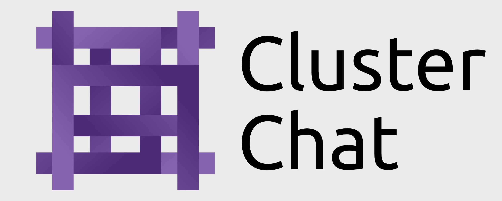

# Dataset Builder
<div align="center">
    <div style="display: flex; align-items: center; justify-content: center; gap: 15px;">
        
    </div>
    <br>
    <a href="https://github.com/Tyguy047/Cluster-Dataset-Builder"></a>
    <a href="https://huggingface.co/datasets/Tyguy047/Cluster-Synthetic-Dataset"></a>
    <a href="https://github.com/Tyguy047/Cluster-Dataset-Builder/issues"></a>
    <a href="https://github.com/Tyguy047/Cluster-Dataset-Builder/blob/main/LICENSE"></a>
    <br>
    <a href="https://design.tylercaselli.com"></a>
</div>

## Patch Notes - (0.1 Beta 5/15/2025):
- ```Qwen3 0.6B``` was removed because it could not handel large inputs like when it had to review the votes of other models. Some Qwen outputs may still be in the early lines of the dataset.

## About
The **Synthetic Conversations** dataset is a set made up of inputs and outputs that was completely automated and generated by AI language models. I used AI models such as DeepSeek R1 Llama 70B Distil, Google's Gemini 2.0 Flash, Microsoft's Phi 3, and Qwen3-0.6B.
<hr>

## Development Process
This is a fully automated dataset that was built from Google's Gemini 2.0 Flash AI model asking complex questions and other AI models answering those questions. I used:

- ```DeepSeek R1 Llama 70B Distil```
- ```Gemini 2.0 Flash```
- ```Phi 4 Reasoning```
- ```Qwen3 0.6B```

Only the best responses are selected and added to the dataset. This is done by having all of the AI models voting on which output they think is the best without being able to vote for their own output.
<hr>

## File Map
The main dataset file is ```new_dataset.jsonl```. The input and outputs are classified as:
- ```"user_input:"```
- ```"output:"```

If you are looking for all of the prompts that were asked to generate the outputs, look in the ```asked.txt``` file.

The ```Resources``` folder contains static images and GIF assets and the files for the tools that were used to create them. ```Resources/synthetic-conversations.gif``` and ```Resources/cluster-logo.png```, are used as the title for this file.

The ```outputs``` folder is used to store outputs from all the AI models after they reply to the question input generated by Gemini 2.0 Flash.

```vote.txt``` is where the AI models will write their vote. ```dataset_builder.py``` reads this to find the winner.

```dataset_builder.py``` is the main file. When run it will begin to build the dataset.

Each AI has its own ```.py``` file which is used to interact with it via its API. (***Be sure to create your own ```.env``` and add your API keys as they appear in their corresponding AI file!***).

The AI's that are included in this version of the program are:
- ```gemini.py``` Using gemini-2.0-flash the offical Gemini API and google-geai SDK.
- ```deepseek.py``` Running DeepSeek R1 Llama 70B Distil running as a DigitalOcean AI Agent. Interact with the agent with the openai SDK.
- ```phi.py``` Using an OpenRouter API and the openai SDK.

All dependencies can be found in and installed from ```requirements.txt```.
<hr>